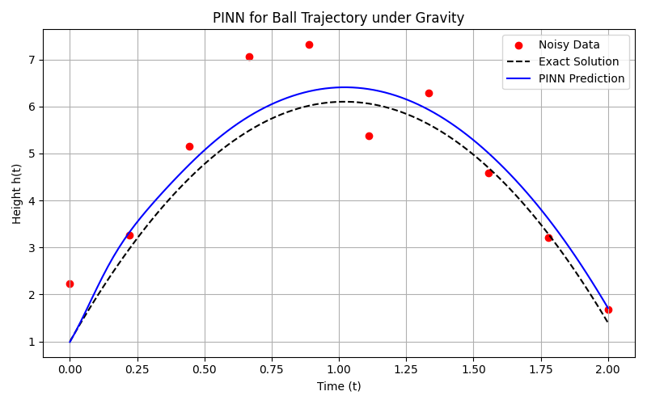

# PINN for Modeling Vertical Ball Trajectory under Gravity

This repository contains a Physics-Informed Neural Network (PINN) implementation to predict the vertical trajectory of a ball under gravity. The PINN learns from noisy observations while being constrained by the known physics:

\[
\frac{dh}{dt} = v_0 - g t
\]

with the initial condition:

\[
h(0) = h_0
\]

---

## Features

- Models the vertical ball trajectory using a neural network informed by physics.
- Handles noisy observational data.
- Trains efficiently with a combined loss of data, physics (ODE), and initial condition constraints.
- Provides visual comparison between predicted trajectory, noisy data, and exact solution.

---

## Setup

```bash
python3 -m venv env
python3 -m pip install requirements.txt
```

---

## Results

